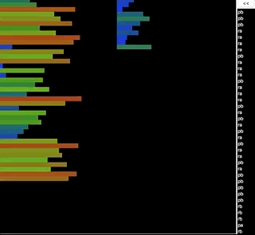

# Sorting the stack

In this project, it was necessary to implement sorting of elements in the stack
To do this, I implemented methods for moving elements on the stack, and directly sorting itself using the second temporary stack
The project had limitations on the number of stack operations (not on the number of actions of the sorting algorithm)
3 numbers = 2 operations
5 numbers = up to 12 operations
100 numbers = up to 700 operations
500 numbers = up to 6500 operations

## Technologies

1. C
2. Make

## Launch

1. Build a project using Makefile

   ```sh
   $ make
   ```

2. Run the program with the arguments (as numbers) that you want to sort, like this:

   ```sh
   $ ./push_swap 5 4 3 2 1
   ```

  In response, you will receive a list of operations for a complete sorting of the A stack:
  
        ```sh
        $ rra
        $ pb
        $ pb
        $ sa
        $ rra
        $ pa
        $ ra
        $ pa
        ```
    
## Vizualization

  
